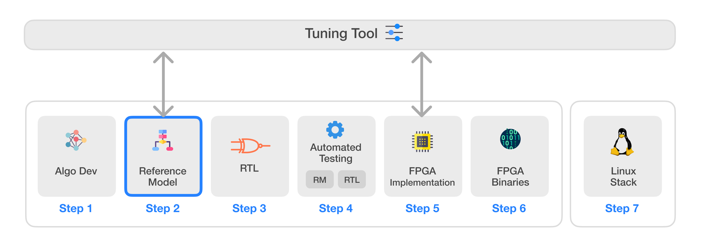
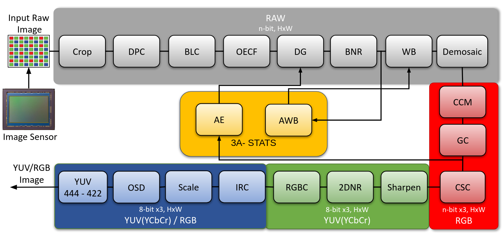

# Infinite-ISP
Infinite-ISP is a full-stack ISP development platform designed for all aspects of a hardware ISP. It includes a collection of camera pipeline modules written in Python, a fixed-point reference model, an optimized RTL design, an FPGA integration framework and its associated firmware ready for Xilinx® Kria KV260 development board. The platform features a stand-alone Python-based Tuning Tool that allows tuning of ISP parameters for different sensors and applications. Finally, it also offers a software solution for Linux by providing required drivers and a custom application development stack to bring Infinite-ISP to the Linux platforms.




| Sr.     | Repository name        | Description      | 
|---------| -------------  | ------------- |
| 1  | **[Infinite-ISP_AlgorithmDesign](https://github.com/10x-Engineers/Infinite-ISP)**   | Python based model of the Infinite-ISP pipeline for algorithm development |
| 2  | **[Infinite-ISP_ReferenceModel](https://github.com/10x-Engineers/Infinite-ISP_ReferenceModel)**  :anchor:   | Python based fixed-point model of the Infinite-ISP pipeline for hardware implementation |
| 3  | **[Infinite-ISP_RTL](https://github.com/10x-Engineers/Infinite-ISP_RTL)**  | RTL Verilog design of the image signal processor based on the Reference Model |
| 4  | **[Infinite-ISP_AutomatedTesting](https://github.com/10x-Engineers/Infinite-ISP_AutomatedTesting)** | A framework to enable the automated block and multi-block level testing of the image signal processor to ensure a bit accurate design |
| 5  | **FPGA Implementation**  | FPGA implementation of Infinite-ISP on <br>  <ul><li>Xilinx® Kria KV260’s XCK26 Zynq UltraScale + MPSoC **[Infinite-ISP_FPGA_XCK26](https://github.com/10x-Engineers/Infinite-ISP_FPGA_XCK26)** </li></ul>   |
| 6  | **[Infinite-ISP_FPGABinaries](https://github.com/10x-Engineers/Infinite-ISP_FPGABinaries)**         | FPGA binaries (bitstream + firmware executable) for the Xilinx® Kria KV260’s XCK26 Zynq UltraScale + MPSoC|
| 7  | **[Infinite-ISP_TuningTool](https://github.com/10x-Engineers/Infinite-ISP_TuningTool)**                              | Collection of calibration and analysis tools for the Infinite-ISP |
| 8  | **[Infinite-ISP_LinuxCameraStack](https://github.com/10x-Engineers/Infinite-ISP_LinuxCameraStack.git)** | Extending Linux support to Infinite-ISP and the developement of Linux-based camera application stack |

**[Request Access](https://docs.google.com/forms/d/e/1FAIpQLSfOIldU_Gx5h1yQEHjGbazcUu0tUbZBe0h9IrGcGljC5b4I-g/viewform?usp=sharing)** to **Infinite-ISP_RTL, Infinite-ISP_AutomatedTesting** and **Infinite-ISP_FPGA_XCK26** repositories


# Infinite-ISP Reference Model: A Python-based Model for RTL Implementation of Camera Pipeline Modules

## Overview
Infinite-ISP Reference Model is a Python based fixed-point implementation of Infinite-ISP pipeline. It is a comprehensive collection of camera pipeline modules, designed to convert input RAW images from sensors to output RGB images. The model provides a reference implementation that aids in generating RTL code enabling rigorous testing, verification, and validation of the pipeline's functionality and behavior.

This model uses lookup tables for complex functions like Gaussian and Sigmoid, applies fixed-point numbers or custom approximations for divisions and square roots, optimizing for minimum loss in image quality.

In its current state, the model implements simple algorithm per module, with plans to incorporate RTL-friendly complex algorithms in future versions.



ISP pipeline for `InfiniteISP_ReferenceModel v1.0`


## Contents

1. **RTL-friendly Code**: The model provides a Python implementation of camera pipeline modules that can be directly translated to RTL, with optimizations such as lookup tables, custom approximations, and integer calculations.

2. **Dataset Processing**: The model facilitates execution for multiple images with different or same configuration files.

3. **Video Processing**: The model also features a video processing script that allows for sequential frame processing, with operational 3A Statistics data flowing between frames.


## Objectives

The primary objective of Infinite-ISP_ReferenceModel is to create a open source Python-based Model that streamlines the process of implementing camera pipeline modules into RTL-friendly implementations. This enables seamless integration with hardware designs and simplifies the development of efficient image processing systems. By providing optimized algorithms, and video processing capabilities, the model aims to be an invaluable tool for developers working on image processing projects and RTL implementations.

# Features List

The table below provides a feature list of the model. The version `1.0` of the model implements hardware-friendly and simple algorithms for each module.


| Modules        | Infinite-ISP_ReferenceModel  | 
| -------------  | ------------- |         
| Crop                                          | Crops image with Bayer pattern safe cropping    | 
| Dead Pixel Correction                         | Modified  [Yongji's et al, Dynamic Defective Pixel Correction for Image Sensor](https://ieeexplore.ieee.org/document/9194921)|
| Black Level Correction                        | Calibration / sensor dependent <br> - Applies parameters from the config file tunable using the tuning tool|
| Optical Electronic Transfer Function (OECF)   | Calibration / sensor dependent <br> - Implements a LUT from config |
| Digital Gain                                  | Gains from config file <br>- In auto mode AE feedback is incorporated for digital gain selection|
| Bayer Noise Reduction                         | [Green Channel Guiding Denoising by Tan et al](https://www.researchgate.net/publication/261753644_Green_Channel_Guiding_Denoising_on_Bayer_Image) <br>  - Implements Chroma and Spatial filters through LUTs |
| Auto White Balance                            | Enhanced [Gray World](https://www.sciencedirect.com/science/article/abs/pii/0016003280900587) <br>- AWB stats calculations within an optimal threshold    |
| White Balance                                 | WB gains multiplication <br> - Parameters from the config file tunable using the tuning tool |
| Demosaic                         | [Malwar He Cutler’s](https://www.ipol.im/pub/art/2011/g_mhcd/article.pdf ) demosaicing algorithm  |
| Color Correction Matrix                       | Calibration / sensor dependent <br> - 3x3 CCM from the config file tunable using the tuning tool|
| Gamma Correction             |Implements a LUT from config |
| Auto Exposure                                 | [Auto Exposure](https://www.atlantis-press.com/article/25875811.pdf) <br> - AE stats calculations based on skewness |
| Color Space Conversion                        | YCbCr digital <br> - BT 601 <br> - Bt 709  <br>   |YCbCr digital <br> - BT 601 <br> - Bt 709  <br> |
| Sharpening                                    | Simple unsharp masking with strength control      |
| Noise Reduction                               | [Non-local means filter](https://www.ipol.im/pub/art/2011/bcm_nlm/article.pdf) <br> - Implements intensity level difference  through a LUT|
| RGB Conversion                               | Converts YCbCr digital image to RGB|
| Invalid Region Crop    | Crops image to a fixed size|
|On Screen Display       | Adds 10x Logo on top left corner             | 
| Scale                                         | Nearest Neighbor <br> - Integer Scaling |
| YUV Format                                    | YUV <br> - 444 <br> - 422 |


## Dependencies
The project is compatible with `Python_3.9.12`

The dependencies are listed in the [requirements.txt](requirements.txt) file. 

The project assumes pip package manager as a pre-requisite.

## How to Run
Follow the following steps to run the pipeline
1.  Clone the repo using 
```shell
git clone https://github.com/10xEngineersTech/Infinite-ISP_ReferenceModel
```

2.  Install all the requirements from the requirements file by running
```shell
pip install -r requirements.txt
```
3. Run [isp_pipeline.py](isp_pipeline.py) 
```shell
python isp_pipeline.py
```


### Example

There are a few sample images with tuned configurations already added to the project at [in_frames/normal](in_frames/normal) folder. In order to run any of these, just replace the config file name with any one of the sample configurations provided. For example to run the pipeline on `Indoor1_2592x1536_12bit_RGGB.raw` simply replace the config file name and data path in [isp_pipeline.py](isp_pipeline.py) 

```python
CONFIG_PATH = './config/Indoor1_2592x1536_12bit_RGGB-configs.yml'
RAW_DATA = './in_frames/normal/data'
```

## How to Run on Pipeline on Multiple Images/Dataset

There are two scripts that run Infinite-ISP on multiple images:


1. [isp_pipeline_dataset.py](isp_pipeline_dataset.py) 
    <br >Execute multiple images. Raw image should have its own config file with name `<filename>-configs.yml` where `<filename>` is raw filename otherwise the default configuration file [configs.yml](config/configs.yml) is used.


2. [video_processing.py](video_processing.py) 
   <br> Each image in the dataset is considered as video frame in sequence. All images use the same configuration parameters from [configs.yml](config/configs.yml) and 3A Stats calculated on a frame are applied to the next frame.

After cloning the repository and installing all the dependencies follow the following steps:

1.  Set `DATASET_PATH` to dataset folder. For example if images are in in [in_frames/normal/data](in_frames/normal/data) folder
```python
DATASET_PATH = './in_frames/normal/data'
```

2. If your dataset is present on another git repository you can use it as a submodule by using the following commands in the root directory. In the command, `<url>` is the address of git repository such as `https://github.com/<user>/<repository_name` and `<path>` is the location in your repository where you want to add the submodule and for Infinite ISP `<path>` should be `./in_frames/normal/<dataset_name>`. Please keep in mind that your `<dataset_name>` should not be `data` because directory [in_frames/normal/data](in_frames/normal/data) already exists.

```shell
git submodule add <url> <path>
git submodule update --init --recursive
``` 


4. After adding git repository as a submodule update `DATASET_PATH` variable in [isp_pipeline_dataset.py](isp_pipeline_dataset.py) to `./in_frames/normal/<dataset_name>`. Git does not allow to import a repository’s subfolder using a submodule. You can only add an entire repository and then access the folder. If you want to use images from a subfolder of a submodule modify the `DATASET_PATH` variable in [isp_pipeline_dataset.py](isp_pipeline_dataset.py)  or [video_processing.py](video_processing.py)  accordingly.

```python
DATASET_PATH = './in_frames/normal/<dataset_name>'
```

5. Run `isp_pipeline_dataset.py` or `video_processing.py`
6. The processed images are saved in [out_frames](out_frames/) folder.

## Contributing

Please read the [Contribution Guidelines](docs/CONTRIBUTIONS.md) before making a Pull Request

## Results
Here are the results of this pipeline compared with a market competitive ISP. 
The outputs of our ISP are displayed on the right, with the underlying ground truths on the left.

&emsp;&emsp;&emsp;&emsp;&emsp;&emsp;&emsp;&emsp;&emsp;&emsp; **ground truths**     &emsp;&emsp;&emsp;&emsp;&emsp;&emsp;&emsp;&emsp;&emsp;&emsp;&emsp;&emsp;&emsp;&emsp;&emsp;&emsp;&emsp;&emsp;&emsp;&emsp;&emsp;&emsp;&emsp;&emsp;&emsp;&emsp; **infiniteISP_RM** 


A comparison of the above results based on PSNR and SSIM image quality metrics

| Images    | PSNR  | SSIM  |
|-----------|-------|-------|
| Indoor1   |22.5788     |0.8923
|Outdoor1   |19.1544     |0.9048
|Outdoor2   |18.8681     |0.8071
|Outdoor3   |17.2825     |0.7304
|Outdoor4   |19.9814     |0.8198

## User Guide

For more comprehensive algorithms documentation and to understand how to use the python model, please visit the [User Guide](docs/UserGuide.md).

## License 
This project is licensed under Apache 2.0 (see [LICENSE](LICENSE) file).

## Contact
For any inquiries or feedback, feel free to reach out.

Email: isp@10xengineers.ai

Website: http://www.10xengineers.ai

LinkedIn: https://www.linkedin.com/company/10x-engineers/
